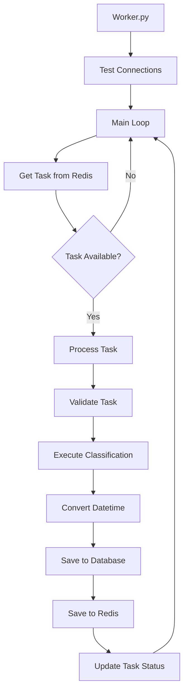

# Vambe AI Worker - Arquitectura Modular

## 📁 Estructura Modular Organizada

```
ai-worker/
├── 📁 core/                   # 🏗️ Componentes principales
│   ├── database.py           # 🗄️ Cliente PostgreSQL
│   ├── redis_client.py       # 🔴 Cliente Redis
│   ├── task_processor.py     # ⚙️ Procesador de tareas
│   └── __init__.py
├── 📁 services/              # 🔧 Servicios de negocio
│   ├── classification_service.py  # 🤖 Servicio de clasificación
│   └── __init__.py
├── 📁 models/                # 📋 Modelos de datos
│   ├── models.py             # Modelos Pydantic
│   └── __init__.py
├── 📁 config/                # ⚙️ Configuración
│   ├── config.py             # Configuración de la aplicación
│   └── __init__.py
├── 📁 tests/                 # 🧪 Tests y validaciones
│   ├── test_modules.py       # Script de pruebas
│   └── __init__.py
├── worker.py                 # 🎯 Punto de entrada principal
├── __init__.py               # 📦 Paquete Python principal
├── requirements.txt          # 📋 Dependencias
├── Dockerfile               # 🐳 Docker
└── README_WORKER.md         # 📖 Esta documentación
```

## 🏗️ Arquitectura

### **1. Worker Principal (`worker.py`)**
- **Responsabilidad**: Orquestar componentes modulares
- **Funciones**:
  - Inicializar conexiones
  - Ejecutar loop principal
  - Manejar señales de apagado
  - Coordinar componentes

### **2. Procesador de Tareas (`task_processor.py`)**
- **Responsabilidad**: Procesar tareas de clasificación
- **Funciones**:
  - Validar formato de tareas
  - Ejecutar lógica de negocio
  - Convertir datos (datetime → string)
  - Coordinar guardado en DB y Redis

### **3. Cliente Redis (`redis_client.py`)**
- **Responsabilidad**: Comunicación con Redis
- **Funciones**:
  - Obtener tareas de la cola
  - Almacenar resultados
  - Actualizar estado de tareas
  - Gestionar conexiones

### **4. Cliente Base de Datos (`database.py`)**
- **Responsabilidad**: Comunicación con PostgreSQL
- **Funciones**:
  - Guardar clasificaciones
  - Actualizar registros existentes
  - Manejar transacciones
  - Gestionar conexiones

## 🔄 Flujo de Trabajo



## 🚀 Uso

### **Ejecución Normal**
```bash
cd ai-worker
python worker.py
```

### **Pruebas de Componentes**
```bash
cd ai-worker
python test_modules.py
```

## 🧪 Pruebas

### **Prueba de Imports**
```bash
python -c "from task_processor import task_processor; print('✅ Imports OK')"
```

### **Prueba de Conexiones**
```bash
python -c "from redis_client import redis_client; redis_client.test_connection()"
python -c "from database import db_client; db_client.test_connection()"
```

## ⚙️ Configuración

### **Variables de Entorno**
```bash
# Redis
REDIS_URL=redis://redis:6379/0

# PostgreSQL
POSTGRES_HOST=db
POSTGRES_PORT=5432
POSTGRES_DB=vambe_db
POSTGRES_USER=postgres
POSTGRES_PASSWORD=password
```

### **Dependencias**
```txt
psycopg2-binary==2.9.9
redis==5.0.1
pydantic==2.5.2
python-dotenv==1.0.0
celery==5.3.4
```

## 🛠️ Desarrollo

### **Agregar Nuevo Módulo**
1. **Decidir ubicación según responsabilidad:**
   - `core/` - Componentes principales (DB, Redis, procesadores)
   - `services/` - Servicios de negocio
   - `models/` - Modelos de datos
   - `config/` - Configuración

2. Crear archivo en carpeta correspondiente
3. Implementar clase principal
4. Crear instancia singleton
5. Actualizar `__init__.py` de la carpeta y el principal
6. Actualizar tests

### **Ejemplo de Nuevo Módulo**
```python
# new_module.py
class NewModule:
    def do_something(self):
        return "Hello from new module"

new_module = NewModule()
```

## 🔧 Mantenimiento

### **Logs y Debugging**
- Cada módulo incluye emojis para fácil identificación
- Mensajes detallados de error
- Estados de conexión verificados al inicio

### **Monitoreo**
```bash
# Ver logs en tiempo real
docker compose logs -f ai-worker

# Ver estado de conexiones
docker compose exec ai-worker python tests/test_modules.py

# Ejecutar pruebas específicas
docker compose exec ai-worker python -c "from core.database import db_client; db_client.test_connection()"
```

## 🎯 Beneficios de la Arquitectura Modular

- **🔧 Mantenibilidad**: Cada módulo tiene responsabilidad única
- **🧪 Testabilidad**: Componentes independientes fáciles de testear
- **🔄 Reutilización**: Módulos pueden usarse en otros proyectos
- **📈 Escalabilidad**: Fácil agregar nuevos módulos
- **🐛 Debugging**: Errores aislados por módulo
- **👥 Colaboración**: Equipos pueden trabajar en módulos separados
