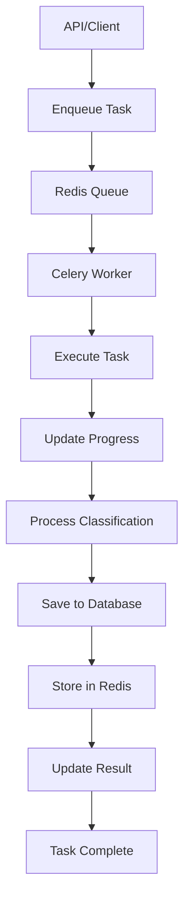

# Vambe AI Worker - Arquitectura Modular con Celery

## 📁 Estructura Modular Organizada

```
ai-worker/
├── 📁 core/                   # 🏗️ Componentes principales
│   ├── database.py           # 🗄️ Cliente PostgreSQL con ORM
│   ├── database_config.py    # ⚙️ Configuración SQLAlchemy
│   ├── redis_client.py       # 🔴 Cliente Redis
│   ├── tasks.py              # 🎯 Tareas de Celery
│   └── __init__.py
├── 📁 services/              # 🔧 Servicios de negocio
│   ├── classification_service.py  # 🤖 Servicio de clasificación (dummy)
│   ├── openai_classification_service.py  # 🧠 Servicio de clasificación con OpenAI
│   └── __init__.py
├── 📁 models/                # 📋 Modelos de datos
│   ├── models.py             # Modelos Pydantic
│   ├── database_models.py    # Modelos SQLAlchemy ORM
│   └── __init__.py
├── 📁 enums/                 # 🏷️ Enumeraciones
│   ├── enums.py              # Enumeraciones del sistema
│   └── __init__.py
├── 📁 config/                # ⚙️ Configuración
│   ├── config.py             # Configuración de la aplicación
│   └── __init__.py
├── app.py                    # 🌸 Aplicación Celery
├── worker.py                 # 🎯 Worker de Celery
├── __init__.py               # 📦 Paquete Python principal
├── requirements.txt          # 📋 Dependencias
├── Dockerfile               # 🐳 Docker
└── README_WORKER.md         # 📖 Esta documentación
```

## 🏗️ Arquitectura con Celery

### **1. Aplicación Celery (`app.py`)**
- **Responsabilidad**: Configuración y setup de Celery
- **Funciones**:
  - Configurar broker (Redis)
  - Configurar result backend
  - Auto-descubrir tareas
  - Configurar routing y colas

### **2. Tareas de Celery (`core/tasks.py`)**
- **Responsabilidad**: Definir tareas asíncronas
- **Funciones**:
  - `classify_meeting_task`: Procesar clasificación de reuniones
  - `health_check_task`: Verificar salud del sistema
  - Manejo de estados y reintentos
  - Integración con servicios modulares

### **3. Worker de Celery (`worker.py`)**
- **Responsabilidad**: Ejecutar worker de Celery
- **Funciones**:
  - Inicializar conexiones
  - Iniciar worker con configuración
  - Manejar concurrencia
  - Procesar colas específicas

### **4. Servicios Modulares**
- **Cliente Redis (`redis_client.py`)**: Comunicación con Redis
- **Cliente Base de Datos (`database.py`)**: Comunicación con PostgreSQL usando SQLAlchemy ORM
- **Configuración DB (`database_config.py`)**: Configuración y gestión de sesiones SQLAlchemy
- **Servicio de Clasificación (`classification_service.py`)**: Lógica de negocio

### **5. Modelos de Datos**
- **Modelos Pydantic (`models.py`)**: Validación y serialización de datos
- **Modelos SQLAlchemy (`database_models.py`)**: Mapeo ORM de la base de datos existente

## 🔄 Flujo de Trabajo con Celery



## 🚀 Uso con Celery

### **Ejecución con Docker Compose (Recomendado)**
```bash
# Iniciar todos los servicios
docker compose up -d

# Ver logs del worker
docker compose logs -f ai-worker
```

### **Ejecución Manual**
```bash
cd ai-worker

# Iniciar worker de Celery
python worker.py
```

### **Comandos Celery Útiles**
```bash
# Ver workers activos
celery -A app inspect active

# Ver estadísticas
celery -A app inspect stats

# Enviar tarea de prueba
celery -A app call core.tasks.health_check_task

# Ver colas
celery -A app inspect active_queues
```


## 🧪 Pruebas

### **Prueba de Conexiones**
```bash
python -c "from core.redis_client import redis_client; redis_client.test_connection()"
python -c "from core.database import db_client; db_client.test_connection()"
```

## ⚙️ Configuración

### **Variables de Entorno**
```bash
# Redis
REDIS_URL=redis://redis:6379/0

# PostgreSQL
POSTGRES_HOST=db
POSTGRES_PORT=5432
POSTGRES_DB=vambe_db
POSTGRES_USER=postgres
POSTGRES_PASSWORD=password

# OpenAI
OPENAI_API_KEY=your_openai_api_key_here
OPENAI_MODEL=gpt-3.5-turbo
```

### **Dependencias**
```txt
psycopg2-binary==2.9.9
redis==5.0.1
pydantic==2.5.2
python-dotenv==1.0.0
celery==5.3.4
sqlalchemy==2.0.23
openai==1.3.7
```

## 🛠️ Desarrollo

### **Agregar Nuevo Módulo**
1. **Decidir ubicación según responsabilidad:**
   - `core/` - Componentes principales (DB, Redis, procesadores)
   - `services/` - Servicios de negocio
   - `models/` - Modelos de datos
   - `config/` - Configuración

2. Crear archivo en carpeta correspondiente
3. Implementar clase principal
4. Crear instancia singleton
5. Actualizar `__init__.py` de la carpeta y el principal
6. Actualizar tests

### **Ejemplo de Nuevo Módulo**
```python
# new_module.py
class NewModule:
    def do_something(self):
        return "Hello from new module"

new_module = NewModule()
```

## 🔧 Mantenimiento

### **Logs y Debugging**
- Cada módulo incluye emojis para fácil identificación
- Mensajes detallados de error
- Estados de conexión verificados al inicio

### **Monitoreo**
```bash
# Ver logs en tiempo real
docker compose logs -f ai-worker

# Ejecutar pruebas específicas
docker compose exec ai-worker python -c "from core.database import db_client; db_client.test_connection()"
```

## 🎯 Beneficios de la Arquitectura Modular con Celery

### **Ventajas de Celery**
- **🚀 Escalabilidad**: Múltiples workers automáticamente
- **⚡ Concurrencia**: Procesamiento paralelo de tareas
- **🔄 Reintentos**: Manejo automático de fallos
- **📊 Monitoreo**: Logs detallados para supervisión
- **🎯 Distribución**: Tareas distribuidas entre workers
- **⏰ Programación**: Tareas programadas y periódicas

### **Ventajas de la Modularización**
- **🔧 Mantenibilidad**: Cada módulo tiene responsabilidad única
- **🧪 Testabilidad**: Componentes independientes fáciles de testear
- **🔄 Reutilización**: Módulos pueden usarse en otros proyectos
- **📈 Escalabilidad**: Fácil agregar nuevos módulos
- **🐛 Debugging**: Errores aislados por módulo
- **👥 Colaboración**: Equipos pueden trabajar en módulos separados

### **Migración Exitosa**
- **✅ Compatibilidad**: Servicios modulares existentes se mantienen
- **✅ Funcionalidad**: Misma lógica de negocio, mejor infraestructura
- **✅ Monitoreo**: Logs detallados proporcionan visibilidad completa
- **✅ Escalabilidad**: Fácil agregar más workers según demanda
- **✅ ORM**: SQLAlchemy para acceso robusto a la base de datos existente
- **✅ Consistencia**: Modelos ORM coinciden con la estructura de la API

### **Ventajas del ORM SQLAlchemy**
- **🔗 Relaciones**: Manejo automático de relaciones entre tablas
- **🛡️ Seguridad**: Protección contra SQL injection
- **🔄 Transacciones**: Manejo automático de transacciones
- **📊 Consultas**: API de consultas más intuitiva y mantenible
- **🎯 Tipado**: Mejor integración con sistemas de tipos de Python
- **🔧 Mantenimiento**: Código más limpio y fácil de mantener

## 🧠 Integración con OpenAI

### **Servicio de Clasificación Inteligente**
El worker ahora incluye un servicio de clasificación avanzado que utiliza OpenAI GPT-3.5-turbo para analizar transcripciones de reuniones y proporcionar clasificaciones precisas y contextuales.

### **Características del Servicio OpenAI**
- **🎯 Modelo Costo-Efectivo**: Utiliza GPT-3.5-turbo (modelo más económico)
- **📊 Clasificación Inteligente**: Analiza transcripciones para identificar categorías de reunión
- **😊 Análisis de Sentimiento**: Detecta el tono y actitud del cliente
- **📝 Extracción de Temas**: Identifica temas clave discutidos
- **✅ Items de Acción**: Extrae compromisos y próximos pasos
- **🔄 Reintentos Automáticos**: Manejo robusto de errores de API
- **⚡ Fallback Inteligente**: Sistema de respaldo si OpenAI falla

### **Prompt de Clasificación Avanzado**
El servicio utiliza un prompt especializado que:
- Analiza cada enum del sistema individualmente
- Selecciona EXACTAMENTE UNA categoría de cada enum (no inventa nuevas)
- Proporciona análisis específicos para TODOS los enums
- NUNCA devuelve null - siempre proporciona análisis o "No specific indicators found"
- Evita respuestas genéricas como "OTHER"
- Usa únicamente los valores exactos de los enums definidos
- Calcula puntuaciones de confianza
- Extrae información estructurada en formato JSON
- Proporciona resúmenes concisos y accionables

### **Análisis de Enums del Sistema**
El sistema ahora analiza cada enum del sistema por separado y proporciona análisis específicos:

- `business_sector`: Análisis del sector de negocio (retail, ecommerce, financial_services, etc.)
- `company_size`: Análisis del tamaño de la empresa (small, medium, large, enterprise)
- `region`: Análisis de la región geográfica (latam_south, latam_north, north_america, etc.)
- `lead_source`: Análisis de la fuente del lead (referral, seo, sem_ads, email, etc.)
- `vambe_product`: Análisis del producto Vambe relevante (mercur, iris, ads, axis)
- `use_case`: Análisis del caso de uso principal (lead_scoring, customer_segmentation, etc.)
- `primary_pain_point`: Análisis del punto de dolor principal (lack_visibility, slow_reporting, etc.)
- `urgency`: Análisis del nivel de urgencia (immediate, short, medium, long)
- `decision_maker_role`: Análisis del rol del tomador de decisiones (ceo, cto, cfo, etc.)
- `purchase_stage`: Análisis de la etapa de compra (discovery, evaluation, pilot, etc.)
- `language`: Análisis del idioma principal (es, en)

**Ventajas del Análisis de Enums:**
- **🎯 Precisión**: Selecciona categorías específicas de los enums definidos
- **📊 Granularidad**: Análisis detallado por cada enum del sistema
- **🚫 Sin "OTHER"**: Evita respuestas genéricas
- **🚫 Sin nulls**: Siempre proporciona análisis para todos los enums
- **🔒 Categorías Controladas**: Solo usa valores predefinidos de los enums
- **💡 Accionable**: Cada análisis es específico y útil para el sistema

### **Configuración de OpenAI**
```bash
# Variable de entorno requerida
OPENAI_API_KEY=your_openai_api_key_here

# Modelo por defecto (configurable)
OPENAI_MODEL=gpt-3.5-turbo
```

### **Ventajas de la Clasificación con IA**
- **🎯 Precisión**: Análisis contextual más preciso que reglas estáticas
- **📈 Escalabilidad**: Procesa cualquier volumen de transcripciones
- **🔄 Consistencia**: Resultados consistentes y objetivos
- **💡 Insights**: Extrae información valiosa automáticamente
- **⚡ Velocidad**: Procesamiento rápido de reuniones
- **💰 Costo-Efectivo**: Utiliza el modelo más económico de OpenAI

## 🗄️ Migración de Base de Datos

### **Actualización de Estructura**
Las nuevas columnas de análisis por categoría individual se han agregado a la migración existente `20250907210610-create-meetings-classifications.cjs`. Para aplicar los cambios:

```bash
# Desde el directorio api/
npm run db:reset  # Si quieres recrear la base de datos
# O si ya tienes datos:
npm run db:migrate
```

### **Nuevas Columnas Incluidas**
La migración existente ahora incluye las siguientes columnas adicionales en `meetings_classifications`:
- `sales_qualified` (TEXT)
- `needs_follow_up` (TEXT)
- `not_interested` (TEXT)
- `pricing_discussion` (TEXT)
- `technical_questions` (TEXT)
- `competitor_mention` (TEXT)
- `decision_maker_absent` (TEXT)
- `budget_constraints` (TEXT)
- `timeline_discussion` (TEXT)
- `closed_won` (TEXT)
- `closed_lost` (TEXT)

### **Compatibilidad**
- ✅ **Retrocompatible**: Las columnas existentes se mantienen
- ✅ **Sin pérdida de datos**: Los datos existentes se preservan
- ✅ **Rollback disponible**: La migración puede revertirse si es necesario
