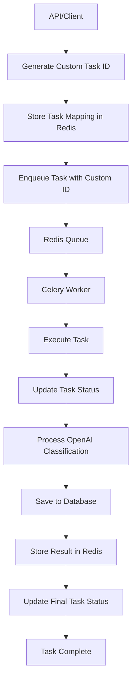

# Vambe AI Worker - Sistema de Clasificación Inteligente

## 📁 Estructura Modular Organizada

```
workers/
├── 📁 core/                   # 🏗️ Componentes principales
│   ├── database.py           # 🗄️ Cliente PostgreSQL con ORM
│   ├── database_config.py    # ⚙️ Configuración SQLAlchemy
│   ├── redis_client.py       # 🔴 Cliente Redis con task tracking
│   ├── tasks.py              # 🎯 Tareas de Celery
│   └── __init__.py
├── 📁 services/              # 🔧 Servicios de negocio
│   ├── openai_classification_service.py  # 🧠 Servicio de clasificación con OpenAI GPT-4o-mini
│   └── __init__.py
├── 📁 models/                # 📋 Modelos de datos
│   ├── models.py             # Modelos Pydantic
│   ├── database_models.py    # Modelos SQLAlchemy ORM
│   └── __init__.py
├── 📁 enums/                 # 🏷️ Enumeraciones
│   ├── enums.py              # Enumeraciones del sistema
│   └── __init__.py
├── 📁 config/                # ⚙️ Configuración
│   ├── config.py             # Configuración de la aplicación
│   └── __init__.py
├── app.py                    # 🌸 Aplicación Celery
├── worker.py                 # 🎯 Worker de Celery
├── __init__.py               # 📦 Paquete Python principal
├── requirements.txt          # 📋 Dependencias
├── Dockerfile               # 🐳 Docker
└── README_WORKER.md         # 📖 Esta documentación
```

## 🏗️ Arquitectura con Celery

### **1. Aplicación Celery (`app.py`)**
- **Responsabilidad**: Configuración y setup de Celery
- **Funciones**:
  - Configurar broker (Redis)
  - Configurar result backend
  - Auto-descubrir tareas
  - Configurar routing y colas

### **2. Tareas de Celery (`core/tasks.py`)**
- **Responsabilidad**: Definir tareas asíncronas
- **Funciones**:
  - `classify_meeting_task`: Procesar clasificación de reuniones con OpenAI
  - `health_check_task`: Verificar salud del sistema
  - Manejo de estados y reintentos
  - Integración con servicios modulares
  - **Nuevo**: Tracking de task IDs personalizados

### **3. Worker de Celery (`worker.py`)**
- **Responsabilidad**: Ejecutar worker de Celery
- **Funciones**:
  - Inicializar conexiones
  - Iniciar worker con configuración
  - Manejar concurrencia
  - Procesar colas específicas

### **4. Servicios Modulares**
- **Cliente Redis (`redis_client.py`)**: Comunicación con Redis + task status tracking
- **Cliente Base de Datos (`database.py`)**: Comunicación con PostgreSQL usando SQLAlchemy ORM
- **Configuración DB (`database_config.py`)**: Configuración y gestión de sesiones SQLAlchemy
- **Servicio de Clasificación OpenAI (`openai_classification_service.py`)**: Clasificación inteligente con GPT-4o-mini

### **5. Modelos de Datos**
- **Modelos Pydantic (`models.py`)**: Validación y serialización de datos
- **Modelos SQLAlchemy (`database_models.py`)**: Mapeo ORM de la base de datos existente

## 🔄 Flujo de Trabajo con Celery



## 🚀 Uso con Docker Compose (Recomendado)

### **Inicio Automático**
```bash
# Iniciar todos los servicios (incluye migraciones y seeds automáticos)
docker compose up --build

# Ver logs del worker
docker compose logs -f workers
```

### **Verificación del Sistema**
```bash
# Health check de la API
curl http://localhost:3000/health

# Health check de workers
curl http://localhost:3000/api/v1/workers/health

# Ver estadísticas del sistema
curl http://localhost:3000/api/v1/workers/stats
```

## 🧠 Sistema de Clasificación con OpenAI

### **Servicio de Clasificación Inteligente**
El worker utiliza OpenAI GPT-4o-mini para analizar transcripciones de reuniones y proporcionar clasificaciones precisas y contextuales.

### **Características del Servicio OpenAI**
- **🎯 Modelo Avanzado**: Utiliza GPT-4o-mini para mejor precisión
- **📊 Clasificación Completa**: Analiza 12 categorías diferentes
- **😊 Análisis de Sentimiento**: Detecta el tono y actitud del cliente
- **📝 Extracción de Temas**: Identifica temas clave discutidos en español
- **✅ Items de Acción**: Extrae compromisos y próximos pasos
- **🔄 Reintentos Automáticos**: Manejo robusto de errores de API
- **⚡ Fallback Inteligente**: Sistema de respaldo si OpenAI falla

### **Categorías de Clasificación**

#### **Información del Negocio**
- **business_sector**: retail, ecommerce, financial_services, insurance, healthcare, pharmaceuticals, energy, utilities, telecom, transportation_logistics, tourism_hospitality, education, government, agroindustry, manufacturing, construction, mining, media_entertainment, software_saas, real_estate, food_beverages, cpg, automotive, ngo, human_resources
- **company_size**: small, medium, large, enterprise
- **region**: latam_south, latam_north, north_america, europe, asia, africa, oceania

#### **Origen y Producto**
- **lead_source**: referral, seo, sem_ads, email, event, partner, outbound_call, cold_email, linkedin, instagram, facebook, webchat, pr, marketplace
- **vambe_product**: mercur (chats+integrations), iris (fast/simple), ads (attribution/marketing), axis (only integrations)

#### **Análisis de la Oportunidad**
- **use_case**: lead_scoring, customer_segmentation, churn_prediction, marketing_attribution, campaign_optimization, demand_forecasting, voice_analytics, operations_automation, real_time_reporting, dw_modernization, fraud_detection, conversational_support
- **primary_pain_point**: lack_visibility, slow_reporting, low_conversion, high_churn, high_advertising_costs, difficult_integrations, regulatory_compliance, dispersed_data, saturated_support, scalability

#### **Contexto de la Reunión**
- **urgency**: true/false (basado en deadlines o presión temporal)
- **decision_maker_role**: ceo, coo, cto, cmo, cio, cfo, head_data, head_ops, head_sales, product_owner, it_manager, analyst, founder
- **purchase_stage**: discovery, negotiation, closure
- **language**: es, en
- **lost_client_bad_meeting**: true/false (basado en confusión o insatisfacción)

#### **Análisis de Contenido**
- **sentiment**: positive, neutral, negative
- **confidence_score**: 0.1 - 0.95
- **key_topics**: Lista de 2-5 temas específicos en español
- **action_items**: Lista de 1-3 acciones específicas en español
- **next_steps**: Descripción concisa del siguiente paso acordado
- **summary**: Resumen de 1-2 oraciones en español

### **Prompt de Clasificación Avanzado**
El servicio utiliza un prompt especializado que:
- Analiza cada categoría del sistema individualmente
- Selecciona EXACTAMENTE UNA categoría de cada enum (no inventa nuevas)
- Proporciona análisis específicos para TODAS las categorías
- NUNCA devuelve null - siempre proporciona análisis o valores por defecto
- Evita respuestas genéricas como "OTHER"
- Usa únicamente los valores exactos de las categorías definidas
- Calcula puntuaciones de confianza
- Extrae información estructurada en formato JSON
- Proporciona resúmenes concisos y accionables en español

## 🔧 Sistema de Tracking de Tareas

### **Task ID Personalizado**
- **Generación**: La API genera UUIDs únicos para cada tarea
- **Mapeo**: Almacena mapeo entre task ID y meeting ID en Redis
- **Tracking**: El worker almacena estados usando el task ID personalizado
- **Consulta**: La API consulta estados específicos por task ID

### **Estados de Tarea**
- **`processing`**: Tarea en progreso
- **`completed`**: Tarea completada exitosamente
- **`failed`**: Tarea falló
- **`pending`**: Tarea no encontrada o expirada

### **Flujo de Tracking**
1. **API**: Genera task ID personalizado
2. **Redis**: Almacena mapeo task ID → meeting ID
3. **Worker**: Procesa tarea y actualiza estado
4. **API**: Consulta estado específico por task ID
5. **Resultado**: Retorna estado correcto y resultados

## ⚙️ Configuración

### **Variables de Entorno**
```bash
# Redis
REDIS_URL=redis://redis:6379/0

# PostgreSQL
POSTGRES_HOST=db
POSTGRES_PORT=5432
POSTGRES_DB=vambe_db
POSTGRES_USER=postgres
POSTGRES_PASSWORD=password

# OpenAI
OPENAI_API_KEY=sk-proj-your-openai-api-key
OPENAI_MODEL=gpt-4o-mini

# Celery
CELERY_BROKER_URL=redis://redis:6379/0
CELERY_RESULT_BACKEND=redis://redis:6379/0
```

### **Dependencias**
```txt
redis==5.0.1
pydantic==2.5.2
python-dotenv==1.0.0
psycopg2-binary==2.9.9
celery==5.3.4
sqlalchemy==2.0.23
openai==1.12.0
httpx==0.25.2
```

## 🧪 Pruebas y Monitoreo

### **Prueba de Conexiones**
```bash
# Test Redis
python -c "from core.redis_client import redis_client; redis_client.test_connection()"

# Test Database
python -c "from core.database import db_client; db_client.test_connection()"

# Test OpenAI
python -c "from services.openai_classification_service import openai_classification_service; print('OpenAI service loaded')"
```

### **Comandos Celery Útiles**
```bash
# Ver workers activos
celery -A app inspect active

# Ver estadísticas
celery -A app inspect stats

# Enviar tarea de prueba
celery -A app call core.tasks.health_check_task

# Ver colas
celery -A app inspect active_queues
```

### **Monitoreo en Tiempo Real**
```bash
# Ver logs del worker
docker compose logs -f workers

# Ver logs de la API
docker compose logs -f api

# Ver logs de Redis
docker compose logs -f redis
```

## 🛠️ Desarrollo

### **Agregar Nueva Categoría de Clasificación**
1. **Actualizar enums**: Agregar nueva categoría en `enums/enums.py`
2. **Actualizar modelo**: Agregar campo en `models/models.py`
3. **Actualizar prompt**: Modificar prompt en `services/openai_classification_service.py`
4. **Actualizar migración**: Agregar columna en base de datos
5. **Probar**: Ejecutar clasificación de prueba

### **Ejemplo de Nueva Categoría**
```python
# enums/enums.py
class NewCategory(str, Enum):
    OPTION_1 = "option_1"
    OPTION_2 = "option_2"
    OPTION_3 = "option_3"

# models/models.py
class ClassificationResult(BaseModel):
    # ... existing fields ...
    new_category: Optional[str] = None
```

## 🎯 Beneficios del Sistema Actualizado

### **Ventajas de la Clasificación con IA**
- **🎯 Precisión**: Análisis contextual más preciso que reglas estáticas
- **📈 Escalabilidad**: Procesa cualquier volumen de transcripciones
- **🔄 Consistencia**: Resultados consistentes y objetivos
- **💡 Insights**: Extrae información valiosa automáticamente
- **⚡ Velocidad**: Procesamiento rápido de reuniones
- **💰 Costo-Efectivo**: Utiliza GPT-4o-mini optimizado

### **Ventajas del Tracking de Tareas**
- **🔍 Visibilidad**: Estado de tareas en tiempo real
- **🎯 Precisión**: Resultados específicos por tarea
- **🔄 Confiabilidad**: No retorna resultados antiguos
- **📊 Monitoreo**: Estadísticas detalladas del sistema
- **🛡️ Robustez**: Manejo de errores y fallbacks

### **Ventajas de la Arquitectura Modular**
- **🔧 Mantenibilidad**: Cada módulo tiene responsabilidad única
- **🧪 Testabilidad**: Componentes independientes fáciles de testear
- **🔄 Reutilización**: Módulos pueden usarse en otros proyectos
- **📈 Escalabilidad**: Fácil agregar nuevos módulos
- **🐛 Debugging**: Errores aislados por módulo
- **👥 Colaboración**: Equipos pueden trabajar en módulos separados

## 🚀 Mejoras Futuras

### **Clasificación de IA**
- **Modelos Avanzados**: Migrar a GPT-4 Turbo o Claude para mejor precisión
- **Fine-tuning**: Entrenar modelos específicos para el dominio de Vambe
- **Validación de Resultados**: Sistema de feedback para mejorar clasificaciones
- **Batch Processing**: Optimizar procesamiento en lotes para mayor eficiencia

### **Arquitectura**
- **Serverless**: Migrar a AWS Lambda para mejor escalabilidad
- **ElastiCache**: Implementar AWS ElastiCache for Redis para mejor performance
- **Auto-scaling**: Configurar auto-scaling basado en métricas
- **Monitoring**: Implementar CloudWatch, DataDog o similar

### **Testing y Calidad**
- **Unit Tests**: Cobertura completa de tests unitarios
- **Integration Tests**: Tests de integración end-to-end
- **Load Testing**: Tests de carga para validar performance
- **Error Tracking**: Sentry o similar para tracking de errores

---

**Vambe AI Worker** - Sistema de clasificación inteligente con OpenAI y tracking de tareas avanzado